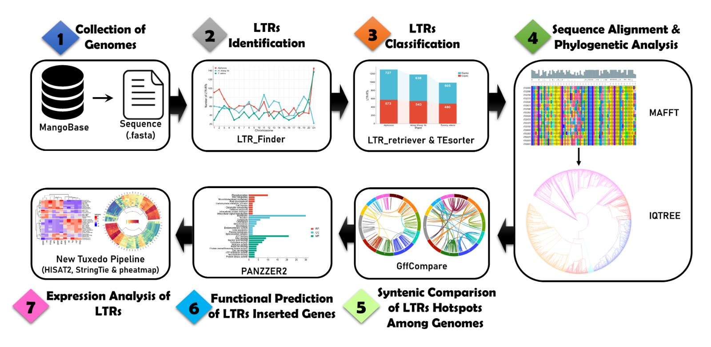

# PlantLTR-Scan: Automated Pipeline for Detecting, Classifying, and Annotating LTR Retrotransposons in Plant Genomes

An automated pipeline for **detection, classification, annotation, and downstream analysis** of **LTR retrotransposons** in plant genomes, integrating multiple tools into a streamlined workflow.

[](https://doi.org/XX.XXXX/zenodo.XXXXXXXX)  <!-- Replace with actual DOI -->

---

## Table of Contents
- [Introduction](#introduction)
- [Features](#features)
- [Installation](#installation)
- [Pipeline Workflow](#pipeline-workflow)
- [Parameters](#parameters)
- [Input & Output Files](#input--output-files)
- [Run PlantLTR-Scan with Test Data](#run-plantltr-scan-with-test-data)
- [Reference](#reference)
- [Contact Us](#contact-us)

---

## Introduction

**Long Terminal Repeat (LTR) retrotransposons** are a major class of transposable elements in plant genomes, often representing a large fraction of the genome size. They play significant roles in genome structure, evolution, and gene regulation. Accurate identification and annotation of LTR retrotransposons is essential for understanding genome dynamics and evolution in plants.

**PlantLTR-Scan** automates the complete workflow for **detecting, classifying, and annotating LTR retrotransposons** from genome assemblies. The pipeline integrates widely used bioinformatics tools **LTR_FINDER**, **LTR_retriever**, **TEsorter**, **MAFFT**, **IQ-TREE**, **gffcompare**, and **Pannzer2** to produce high-quality LTR annotations, phylogenetic trees, and functional analysis of gene-associated LTRs.

---

## Features
- **End-to-end automation**: From raw genome files to classified and annotated LTRs.
- **Plant genome focus**: Optimized parameters and database selection for plant LTR retrotransposons.
- **Classification** into major LTR families such as **Copia** and **Gypsy**.
- **Phylogenetic tree construction and Insertion time estimation** for both Copia and Gypsy elements.
- **Integration with gene annotation** to identify gene-inserted LTRs.
- **Gene Ontology (GO) annotation** for proteins from gene-inserted LTRs.
- **Easy installation** via a single `.sh` script that sets up all dependencies.

---

## Installation

**PlantLTR-Scan** can be installed easily by following commands:

1. **Clone the repository**
    ```bash
    git clone https://github.com/sadaqat17/PlantLTR-Scan.git
    cd PlantLTR-Scan
    # Add the bin to PATH (optional)
    export PATH=$PATH:/path/to/PlantLTR-scan
    ```

2. **Run the dependency installation script**  
   The pipeline includes an installation script that sets up **three conda environments** containing all required tools.
    ```bash
    bash ./bin/Dependencies.sh
    ```

This will automatically install and configure:
- **LTR_FINDER**
- **LTR_retriever=2.9.5**  ( recomended )
- **TEsorter** (rexdb-plant database)
- **MAFFT**
- **IQ-TREE**
- **gffcompare**
- **Pannzer2**
- Python dependencies (Pandas, Numpy, Biopython, and Matplotlib)

 

---

## Pipeline Workflow

Below is the overview of the PlantLTR-Scan workflow.

  

---

## Parameters

The following parameters control **PlantLTR-Scan** execution:

| Parameter  | Description                                                  | Example Usage                |
|------------|--------------------------------------------------------------|------------------------------|
| `-i`       | Path to input directory containing FASTA, GFF, and PEP files | `-i ./input`                 |
| `-s`       | Species name  in scientific notation (used in GO analysis) and in inverted comma's ""                          | `-s "Mangifera indica" `                |
| `-t`       | Number of threads to use (default: 2)                        | `-t 2`   (optional)                  |
| `-b`       | Number of bootstraps for phylogenetic tree construction      | `-b 1000`(optional)                     |
| `-h`       | Display help message                                         | `-h`   (optional)                      |

---

## Input & Output Files

### Input Files

The input directory must contain:
1. **Genome sequence file** (`.fasta`, `.fa`, `.fna`)
2. **Genome annotation file** (`.gff`, `.gff3`, `.gtf`)
3. **Proteome sequence file** (`.pep`)

#### 1. Genome Sequence Files
The genome sequence files should be in FASTA format with the following structure:

```
>chr1
ATCGATCG...
```
*File extensions such as `.fa`, `.fasta`, `.fna`, or other common genome file suffixes are supported. It is recommended to use descriptive names (e.g., `Alphonso.fna`, `Alphonso.fasta` or `Alphonso.fa`). FASTA Header should be short such as chr1*

#### 2. Annotation Files
Annotation files should be in GTF, GFF, GFF3 format and include information about genes, mRNA, exons, and CDS. Below is an example of a valid GFF3 file:

```
chr1	Gnomon	gene	39282	41508	.	-	.	ID=gene-LOC123216202;gene=LOC123216202
chr1	Gnomon	mRNA	39282	41508	.	-	.	ID=rna-XM_044636602.1;Parent=gene-LOC123216202
chr1	Gnomon	exon	39282	39796	.	-	.	ID=exon-XM_044636602.1-3;Parent=rna-XM_044636602.1
chr1	Gnomon	CDS	    40913	41412	.	-	0	ID=cds-XP_044492537.1;Parent=rna-XM_044636602.1;protein_id=XP_044492537.1


```

*Ensure your annotation file (GFF3, GFF, or GTF) includes properly formatted ID, Parent, and protein_id attributes in the 9th column, as these are essential for mapping input gene/mRNA/CDS IDs to their corresponding protein sequences during extraction.* 

#### 3. Proteome sequence file 
```
>XP_044492537.1
MAASRRLRDLQSQPGNKICV...
```
*note proteome file should be in .pep format*

---
 
### Output Files

The pipeline creates the following outputs in the `Results` directory:

- **LTR Finder summary** (`ltr_finder_summary.tsv`, `ltr_finder_barplot.svg`)
- **LTR Retriever summary:Superfamily classification** (`LTR_retriever_summary.tsv`, `ltr_retriever_barplot.svg`)
- **LTR-RTs Clades Level Classification** (`TEsorter_final_LTRs.fasta`)
- **Superfamilies FASTAs** (`copia.fasta`, `gypsy.fasta`)
- **Phylogenetic trees** (`copia.treefile`, `gypsy.treefile`)
- **Gene Inserted LTRs Prediction** (`Gffcompare_summary.txt`)
- **Gene Inserted LTR proteins** (`Gene_inserted_LTR_proteins.fasta`)
- **Gene Ontology Files** (`GO_BP.tsv`, `GO_CC.tsv`, `GO_MF.tsv`)

---

### Run PlantLTR-Scan with Test Data
To run **PlantLTR-Scan** with the test data, use the following command:

`PlantLTR_scan` *Without Bootstrap Analysis*

```
PlantLTR-Scan.sh -i ./input -s "Mangifera indica"
```
`PlantLTR_scan` *with bootstrap (In phylogenetic analysis) value* 
```
PlantLTR-Scan.sh -i ./input -s "Mangifera indica" -t 12 -b 1000
```
*`Note`  By using bootstrap value, it will take longer duration for phylogenetic analysis*

## Reference
- In process

## Contact Us

For questions or issues, please contact:

- **Mr. Muhammad Sadaqat** – [muhammad.sadaqat@univ-rennes.fr](mailto:muhammad.sadaqat@univ-rennes.fr)  
- **Mr. Rana Sheraz Ahmad** – [ranasheraz.202101902@gcuf.edu.pk](mailto:ranasheraz.202101902@gcuf.edu.pk)
- **Dr. Muhammad Tahir ul Qamar** – [m.tahirulqamar@hotmail.com](mailto:m.tahirulqamar@hotmail.com)  


=======
# PlantLTR-Scan
PlantLTR-Scan: Automated Pipeline for Detecting, Classifying, and Annotating LTR Retrotransposons in Plant Genomes
>>>>>>> b74376a001bfc6d730f1ad50615cbd1b131aa4d1
